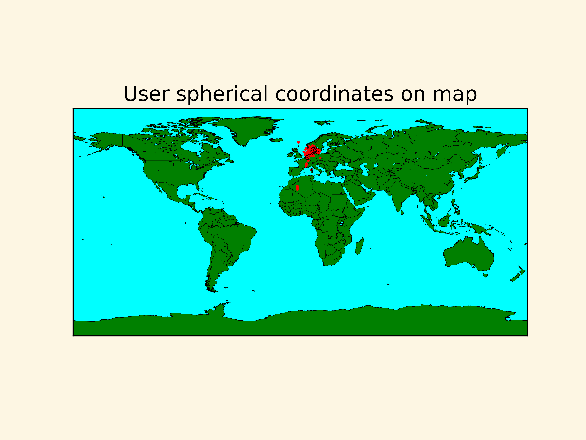
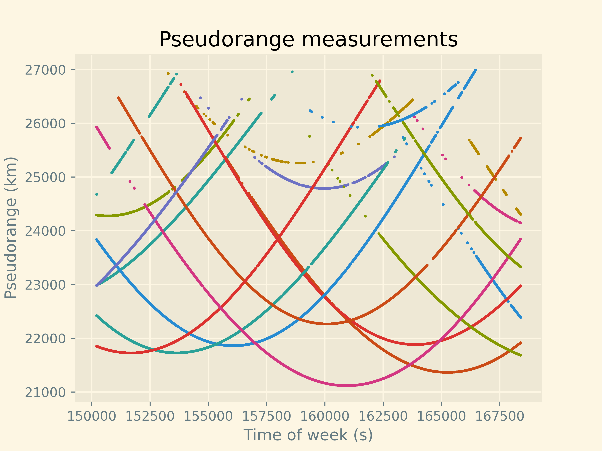
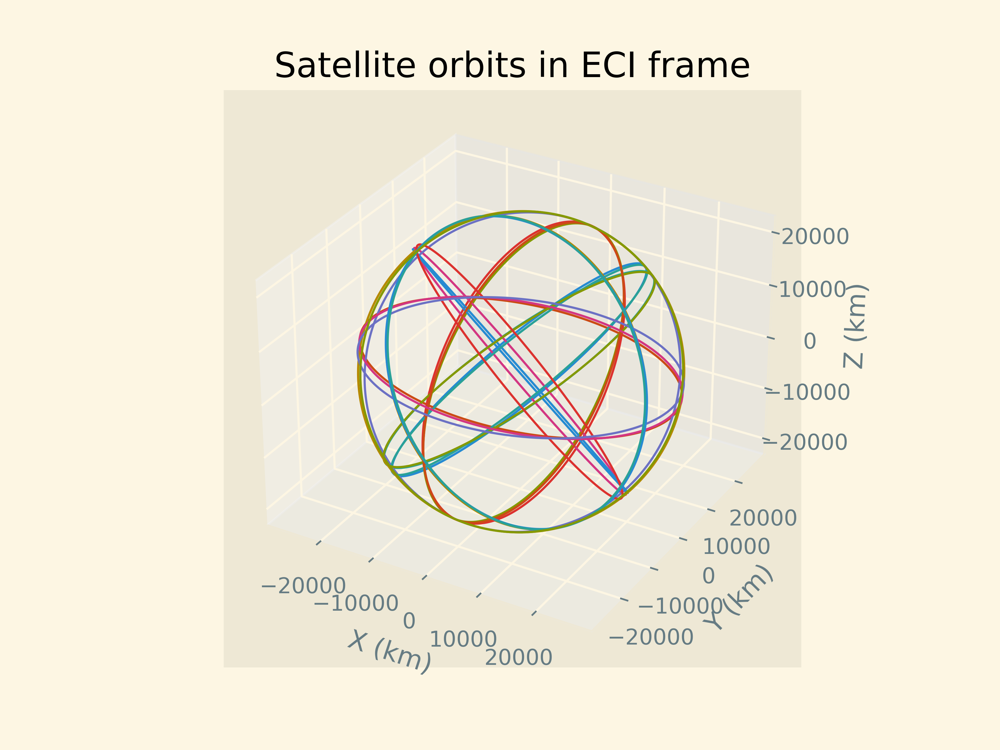

# GPS-From-Scratch

This project aims to implement GPS positioning from scratch with some simplifying assumptions.

## Prerequisites

The scripts in this project depend on the [pyrtcm](https://github.com/semuconsulting/pyrtcm) library for parsing the RTCM3 messages, which is installed with:

```bash
pip install pyrtcm
```

The project also depends on the [numpy](https://github.com/numpy/numpy) library for vector and matrix operations:

```bash
pip install numpy
```

For plotting graphs [matplotlib](https://github.com/matplotlib/matplotlib) is used:

```bash
pip install matplotlib
```

And finally, [basemap](https://github.com/matplotlib/basemap) is used to plot data on maps:

```bash
pip install basemap
```

## Usage

To run this project, place your RTCM file in the "data" directory and run the Python file "gps_from_scratch.py" in the "src" directory. This action will create some plots from the data in the "plots" directory.

## Explanation

### GPS Signals

This project uses the [RTCM3 protocol](https://en.wikipedia.org/wiki/RTCM_SC-104) to encode the raw GPS data sent by the GPS satellites in messages 1002 and 1019.

Message 1002 contains information about the [pseudorange](https://en.wikipedia.org/wiki/Pseudorange), which is the approximate distance from the receiver to the satellites.

Message 1019 contains information about the orbit of the satellites, including the [Keplerian elements](https://en.wikipedia.org/wiki/Orbital_elements#Keplerian_elements) used to calculate the position of the satellite at any given time.

### Simplifying Assumptions

To implement GPS positioning in a more approachable manner, some simplifying assumptions were made:

* Pseudoranges are not corrected for any error except for the clock bias in the receiver. Most importantly, this means that effects such as [atmospheric effects](https://en.wikipedia.org/wiki/Error_analysis_for_the_Global_Positioning_System#Atmospheric_effects) are ignored.

* The satellite orbits are based only on [Kepler's laws](https://en.wikipedia.org/wiki/Kepler's_laws_of_planetary_motion) and are not corrected. This means that relativistic effects on orbits are ignored, due to their eccentricity being more than zero.

* The earth is assumed to be perfectly spherical with its center of mass in the center of the sphere, instead of approximating it as an [ellipsoid](https://en.wikipedia.org/wiki/Earth_ellipsoid). This simplification means there will be an error in mapping ECEF coordinates to spherical coordinates.

## Results

The following map shows the distribution of calculated positions based on each measurement:



As we can see, the points are scattered a lot due to our simplifying assumptions while being clustered around Denmark, where the RTCM data was recorded. Therefore, we know that we have successfully implemented the elementary mechanisms of GPS positioning.

This plot shows the raw pseudorange measurements of different GPS satellites during the recording. It is possible to see when satellites gain and lose connection to the receiver: 



This plot shows the extrapolated orbits in an ECI frame of the GPS satellites whose Keplerian parameters were received during the recording:



See other plots in the "plots" directory.
